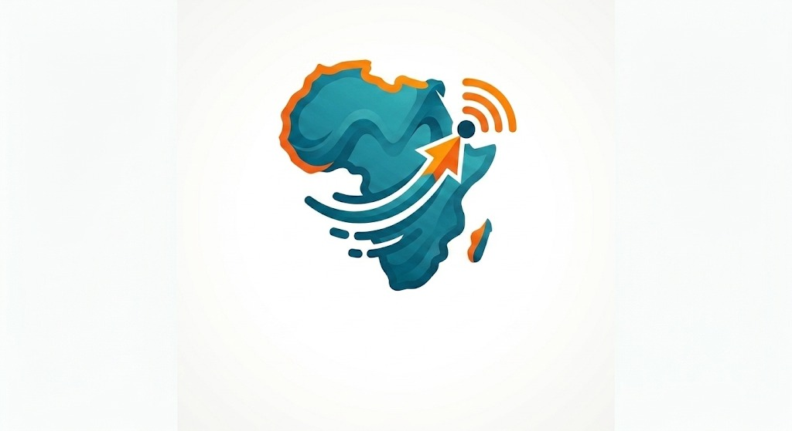

<div align="center">



<br />

# MOBI BIT AFRICA

### ⚡ Lightning-Powered Bitcoin Card for Africa ⚡

<br />

*"Banking the unbanked, one sat at a time."*

<br />


<br />

[Quick Start](#-quick-start) ·
[Features](#-features) ·
[Architecture](#-architecture) ·
[API](#-api) ·
[Setup](#-setup) ·
[Deploy](#-deploy)

</div>

---

## 🌍 Our Mission

**Mobi Bit Africa** is on a mission to make Bitcoin accessible to every African — regardless of whether they have a bank account. We believe that financial freedom should not be a privilege. By connecting mobile money — the financial backbone of Africa — to the Bitcoin Lightning Network, we empower millions to save, send, and spend in a borderless digital economy.

> **Vision:** A financially inclusive Africa where everyone participates in the global Bitcoin economy.
>
> **Mission:** Bridge mobile money and Bitcoin to bring financial freedom to the unbanked.

---

## What We Do

<div align="center">

| 💰 **Deposit** | ⚡ **Convert** | 💳 **Spend** |
|:-------------:|:-------------:|:------------:|
| Fund via MTN, Airtel, or Orange Money | Fiat → BTC via Lightning Network | Use a virtual card anywhere |

</div>

---

## ✨ Features

<div align="center">

| Feature | Details |
|:-------:|---------|
| 📱 **Mobile Money** | MTN MoMo · Airtel Money · Orange Money |
| ⚡ **Lightning Network** | Instant Bitcoin send & receive |
| 💳 **Virtual Card** | Spend sats anywhere cards are accepted |
| 🔄 **Live Rates** | Real-time USD ↔ Sats conversion |
| 📱 **13 Pages** | Full app — Login, Dashboard, Card, Fund, Send, Receive, Spend, Transactions, Profile, Settings, Help |
| 📐 **Responsive** | Mobile · Tablet · Desktop |
| 🎨 **Animated** | Smooth transitions with Framer Motion |
| 🏗️ **Production-Ready** | Clean architecture, service layer, state management |

</div>

---

## 🛠️ Tech Stack

<div align="center">

| Layer | Stack |
|:-----:|:------|
| **Frontend** | React 18 · Vite 5 · Tailwind CSS v4 · Framer Motion |
| **Backend** | Python 3.11+ · FastAPI · SQLAlchemy · Alembic |
| **Database** | PostgreSQL 16 (SQLite for dev) |
| **Lightning** | LND via Docker (Polar Network) |
| **Mobile Money** | Africa's Talking · MTN MoMo |
| **Deploy** | Docker · Render |

</div>

---

## 📁 Project Structure

```
mobi-bit-africa/
├── src/                          # React frontend
│   ├── pages/                    # 13 page components
│   ├── components/               # Reusable UI components
│   ├── services/                 # API abstraction layer
│   ├── context/                  # Auth · Wallet · Theme
│   ├── hooks/                    # Custom React hooks
│   ├── data/                     # Mock data
│   ├── utils/                    # Helpers
│   └── assets/                   # Images · logos
│
├── backend/                      # FastAPI backend
│   └── app/
│       ├── api/                  # Route handlers
│       ├── core/                 # Config · database
│       ├── models/               # SQLAlchemy models
│       ├── services/             # Business logic
│       ├── adapters/             # MTN · Airtel · Orange · Lightning
│       └── ussd/                 # USSD flow handler
│
├── docker-compose.yml
├── render.yaml
├── LICENSE
└── README.md
```

---

## 🚀 Quick Start

**Prerequisites:** Node.js v18+ · Python 3.11+ · Docker

```bash
# Clone
git clone https://github.com/your-org/mobi-bit-africa.git
cd mobi-bit-africa

# Install
npm install
cd backend && pip install -r requirements.txt && cd ..

# Run
docker-compose up -d postgres redis   # database
cd backend && uvicorn app.main:app --reload --port 8000   # API
npm run dev                            # frontend
```

Open **http://localhost:5174** → Login with `demo@satscardapp.com` / `demo@123456`

---

## 🏗️ Architecture

**Service Layer** — All API calls go through `src/services/`. Swap mock data for real endpoints without touching components.

```javascript
walletService.getBalance()            // 💰 Wallet
paymentService.fundCard(phone, amt)   // 📱 Mobile Money
paymentService.sendBitcoin(addr, amt) // ⚡ Lightning
authService.login(email, password)    // 🔐 Auth
```

**State Management** — `AuthContext` · `WalletContext` · `ThemeContext`

---

## 📡 API

| Endpoint | Method | Description |
|----------|:------:|-------------|
| `/api/node_info` | `GET` | Lightning node info |
| `/api/balance` | `GET` | Wallet balance |
| `/api/card_balance` | `GET` | Card balance |
| `/api/create_invoice` | `POST` | Create Lightning invoice |
| `/api/check_payment/{id}` | `GET` | Check payment status |
| `/api/deposit/{id}` | `POST` | Deposit to card |
| `/api/card_payment` | `POST` | Pay from card |
| `/api/transactions` | `GET` | Transaction history |

---

## 📱 Mobile Money

<div align="center">

| Provider | Countries | Mode |
|:--------:|-----------|:----:|
| 🟡 **MTN MoMo** | Rwanda · Uganda · Ghana · DRC | Sandbox ✅ |
| 🔴 **Airtel Money** | Rwanda · Kenya · Uganda | Sandbox ✅ |
| 🟠 **Orange Money** | Senegal · Mali · Côte d'Ivoire | Sandbox ✅ |

</div>

> All providers support sandbox mode — no real money moves during testing. See [SETUP.md](SETUP.md) for configuration.

---

## ⚙️ Setup & Deploy

**Environment Variables** — See [SETUP.md](SETUP.md) for MTN MoMo credentials, API keys, and full configuration.

**Docker:**
```bash
docker-compose up -d
```

**Render:** Connect your repo — `render.yaml` handles the rest.

---

## 📋 Changelog

| Version | Date | Changes |
|:-------:|:----:|---------|
| **1.0.0** | Aug 2026 | Initial release — 13 pages, Lightning integration, mobile money adapters |
| **0.9.0** | Aug 2026 | Backend API with FastAPI, Alembic migrations, Polar Network setup |
| **0.8.0** | Aug 2026 | Frontend foundation — React, Tailwind, design system, service layer |

---

## 🙏 Acknowledgments

- **[Bitcoin Lightning Network](https://lightning.network/)** — Enabling instant, low-cost Bitcoin payments
- **[Polar](https://polar.sh/)** — Local Lightning Network development environment
- **[Africa's Talking](https://africastalking.com/)** — Mobile money and USSD API infrastructure
- **[MTN MoMo Developer Portal](https://momodeveloper.mtn.com/)** — Mobile money sandbox and APIs
- **[FastAPI](https://fastapi.tiangolo.com/)** — Modern Python web framework
- **[React](https://react.dev/)** — UI library powering the frontend
- **[Tailwind CSS](https://tailwindcss.com/)** — Utility-first CSS framework
- **[Framer Motion](https://www.framer.com/motion/)** — Animation library
- **[Lucide Icons](https://lucide.dev/)** — Beautiful, consistent icon set

---

## 📄 License

This project is licensed under the MIT License — see [LICENSE](LICENSE) for details.

---

<div align="center">

### Built with ❤️ by **Mobi Bit Africa**

*Bridging mobile money and Bitcoin across Africa*

<br />

[](https://twitter.com)
[](https://github.com)
[](https://linkedin.com)

</div>
